# dotfiles

今の WSL / bash 環境を復元するための dotfiles。

旧 `WakuwakuP/dotfiles`（zsh / windyakin 系）と、実環境で使っていた `dotfiles-old` を、現在のカスタムに合わせて作り直している。

## 入っているもの

- bash（モジュール分割）
- tmux（prefix `C-t`、Vim キー、win32yank、tpm）
- git（身元・GPG 署名・gh credential・ghq root。既定値 `~/ghq`）
- fzf（PowerShell の `g` と同等の ghq プレビュー） / starship / nano / gh CLI 設定
- Cursor ユーザールールとプラグイン一覧

## 入れていないもの

SSH 鍵、実ホストの `~/.ssh/config`、GPG 秘密鍵、`gh` のトークン、`.local` のキャッシュはリポジトリに入れない。GitHub / SSH / GPG は対話セットアップから端末へ安全に設定できる。

## Quick start

### 初回セットアップ（対話式）

次のコマンドだけで `~/.dotfiles` への clone とセットアップを実行する。

```bash
curl -fsSL https://raw.githubusercontent.com/WakuwakuP/dotfiles/master/install.sh | bash
```

### clone 済みの場合

リポジトリのディレクトリで実行する。

```bash
./setup.sh
```

### 非対話でセットアップ

初回セットアップをすべて既定値で実行する。

```bash
curl -fsSL https://raw.githubusercontent.com/WakuwakuP/dotfiles/master/install.sh | bash -s -- --yes
```

clone 済みの場合はこちら。

```bash
./setup.sh --yes
```

### セットアップ内容

`setup.sh` は次を順に確認する。ghq の保存先は対話時に変更でき、端末固有の設定として `~/.config/git/ghq.gitconfig` に保存される。初回の既定値は `~/ghq` で、再実行時は現在の設定値を維持する。

1. 設定ファイルのシンボリックリンク（既存は `~/.dotfiles-backup-*` に退避）
2. apt パッケージ（`tmux fzf bat gh git gpg`、あれば `lsd`）
3. `ghq` とリポジトリ保存先（既定値 `~/ghq`）
4. tmux plugin manager（tpm / tmux-sensible）
5. WSL 用 `win32yank.exe`
6. `starship`（`powerline-shell` の代替。プロンプトが速い）
7. Cursor ルールを `~/.cursor/rules` へ
8. GitHub / SSH / GPG の機密情報セットアップ（対話実行時のみ）
9. Ubuntu 再起動通知（Discord）設定（任意。`scripts/check-reboot.sh` の設定）

### 対話セットアップのフロー

`install.sh` から実行した場合も、clone または更新後に同じフローへ入る。通常セットアップの1〜7は既定で `Yes`、機密情報（8）および再起動通知（9）は既定で `No`、`--yes` 実行時は 8/9 の両方をスキップする。

```mermaid
flowchart TD
    Start([setup.sh を開始]) --> Q1{"1/9 設定ファイルをリンクする?"}
    Q1 -->|Yes| A1[既存設定をバックアップしてシンボリックリンク]
    Q1 -->|No| Q2
    A1 --> Q2{"2/9 apt パッケージをインストールする?"}

    Q2 -->|Yes| A2[tmux・fzf・bat・gh・git・gpg などをインストール]
    Q2 -->|No| Q3
    A2 --> Q3{"3/9 ghq をインストールして保存先を設定する?"}

    Q3 -->|No| Q4
    Q3 -->|Yes| G1[ghq をインストール]
    G1 --> G2[保存先を入力 現在値または初回 ~/ghq]
    G2 --> G3{"保存先の状態"}
    G3 -->|通常のファイル| Error([エラーで終了])
    G3 -->|ディレクトリが存在| G6[ghq.root を保存]
    G3 -->|存在しない| G4{"保存先を作成する?"}
    G4 -->|Yes| G5[ディレクトリを作成]
    G4 -->|No| G6
    G5 --> G6
    G6 --> Q4{"4/9 tmux プラグインをインストールする?"}

    Q4 -->|Yes| A4[tpm と tmux-sensible をインストール]
    Q4 -->|No| Q5
    A4 --> Q5{"5/9 WSL 用 win32yank.exe をインストールする?"}

    Q5 -->|Yes| A5[WSL なら win32yank.exe をインストール]
    Q5 -->|No| Q6
    A5 --> Q6{"6/9 starship をインストールする?"}

    Q6 -->|Yes| A6[starship をインストール]
    Q6 -->|No| Q7
    A6 --> Q7{"7/9 Cursor ルールをリンクする?"}

    Q7 -->|Yes| A7[Cursor ルールをリンク]
    Q7 -->|No| Q8
    A7 --> Q8{"8/9 機密情報をセットアップする?"}

    Q8 -->|No| Q9{"9/9 再起動通知を設定する?"}
    Q8 -->|Yes| C1{"GitHub 認証を設定する?"}
    C1 -->|Yes| C1A[GitHub.com の認証を確認し未認証なら gh auth login]
    C1 -->|No| C2
    C1A --> C2{"SSH 鍵と設定を復元する?"}
    C2 -->|Yes| C2A[復元元を入力]
    C2 -->|No| C3
    C2A --> C2B{"バックアップ付きで ~/.ssh を置換する?"}
    C2B -->|Yes| C2C[既存設定を退避して復元]
    C2B -->|No| C3
    C2C --> C3{"GPG 秘密鍵をインポートする?"}
    C3 -->|Yes| C3A[秘密鍵ファイルを入力して対象フィンガープリントを検証]
    C3 -->|No| Q9
    C3A --> C3B{"検証済みの秘密鍵をインポートする?"}
    C3B -->|Yes| C3C[gpg --import]
    C3B -->|No| Q9
    C3C --> Q9

    Q9 -->|No| Notes
    Q9 -->|Yes| R1[不足する依存をaptで導入]
    R1 --> R2[Webhook URLを非表示入力 空入力なら有効な既存設定を再利用]
    R2 --> R3{"有効なURLがある?"}
    R3 -->|未設定かつ空入力| Notes
    R3 -->|不正な入力| Error
    R3 -->|Yes| R4[既存crontabを読み込む]
    R4 --> R5[cronを起動し稼働確認 systemdなら自動起動も有効化]
    R5 --> R6[Webhookを権限600で保存]
    R6 --> R7[管理マーカー付きの12時ジョブを重複なく登録]
    R7 --> Notes

    Notes[手動設定するプラグインと機密情報の注意を表示] --> Done([セットアップ完了])
```



`./setup.sh --yes` では 1〜7 を実行し、機密情報（8）と再起動通知設定（9）は安全のためスキップする。ghq の保存先は現在の設定値、未設定なら `~/ghq` を使用する。

### 機密情報だけをセットアップ

GitHub / SSH / GPG の対話セットアップは単独でも再実行できる。

```bash
bash ./setup-secrets.sh
```

機密情報はdotfilesへコピーされない。SSHの復元時は既存の `~/.ssh` を `~/.dotfiles-backup-*-secrets.*` へ退避し、GPGは指定ファイルを直接 `gpg --import` する。

## Ubuntu の再起動通知（Discord）

`scripts/check-reboot.sh` は `/var/run/reboot-required` がある場合だけ Discord Webhook に通知する。投稿者名はホスト名、本文には `/var/run/reboot-required.pkgs` のパッケージ一覧を含める。Ubuntu Pro の契約は不要で、このマーカーファイルを生成する Ubuntu の更新機構が対象。自動再起動や Ubuntu Pro / 自動更新の設定変更は行わない。

`--dry-run` では送信を行わず本文のみを確認できる。

### setup.sh への統合

`setup.sh` の 9/9 のステップとして再起動通知設定を追加。既定は `No`。
Yes の場合は次を行う（実送信はしない）。

- `curl` / `jq` / `cron` / `ca-certificates` が不足していれば `apt` で導入
- Webhook URL は **非表示入力**で受け取り
- 有効な既存設定がある場合は **空入力で再利用**
- 既存設定がなく空入力ならこのステップをスキップ
- 保存先は `${XDG_CONFIG_HOME:-$HOME/.config}/dotfiles/reboot-notify.json`（`mode 600`）
- 一般ユーザー `crontab` に毎日12時実行のジョブを追加（既存ジョブは維持）
- cron ジョブは管理マーカー付きで重複なく更新
- cron サービスの起動確認（systemd: `sudo systemctl enable --now cron` + `systemctl is-active --quiet cron`、非systemd: `sudo service cron start` + `sudo service cron status`）

この対話フローも `install.sh` のワンライナー経由で実行できる。master へ公開する場合は通常どおり `commit` / `push` / `merge` が必要。

Webhook URL は秘密情報なので Git に追加しない。セットアップ時の保存先は `XDG_CONFIG_HOME` で変更できるが、リポジトリ内への保存は拒否する。通知スクリプトの実行時は `--config /absolute/path/to/config.json` で別の設定ファイルを指定できる。

### 手動設定

Bash・`curl`・`jq`・`cron`・`ca-certificates` が必要。Discord の通知先チャンネルで Webhook を作成してから保存する。

```bash
sudo apt install curl jq cron ca-certificates
CONFIG_FILE="${XDG_CONFIG_HOME:-$HOME/.config}/dotfiles/reboot-notify.json"
mkdir -p "$(dirname "$CONFIG_FILE")"
(umask 077; touch "$CONFIG_FILE")
chmod 600 "$CONFIG_FILE"
nano "$CONFIG_FILE"
```

次の形式で、自分の Webhook URL を保存する（URL をシェル履歴に残さない）。

```json
{
  "webhook_url": "https://discord.com/api/webhooks/WEBHOOK_ID/WEBHOOK_TOKEN"
}
```

### 確認と定期実行

```bash
# 再起動マーカーなしでも本文を確認できる（外部送信なし）
bash ~/.dotfiles/scripts/check-reboot.sh --dry-run

# 再起動が必要な場合だけ実際に送信する
bash ~/.dotfiles/scripts/check-reboot.sh

# 一般ユーザーの cron に登録（sudo は不要）
crontab -e
```

手動で毎日12時（実行環境のタイムゾーン）に確認する場合は以下を追加する。`setup.sh` で設定した場合は追加不要。
クローン先や `XDG_CONFIG_HOME` が異なる場合はパスを変更する。

```cron
0 12 * * * /bin/bash "$HOME/.dotfiles/scripts/check-reboot.sh" --config "$HOME/.config/dotfiles/reboot-notify.json" # dotfiles-reboot-notify
```

`crontab -l` で登録を確認する。`setup.sh` は管理マーカー付きの行だけを重複なく更新し、他のジョブは保持する。

WSL が停止中は通知されず、実行時刻を過ぎたジョブの追跡実行も行わない。非systemd環境ではサービスを起動して稼働確認するが、OS起動時の自動起動までは設定しない。手動設定の場合も cron サービスが動いていることを確認する。

再起動するまで実行のたびに通知し、ホスト名とパッケージ名が Discord に送信される。`setup.sh` 側は設定/登録時に実送信を行わない。パッケージ一覧がない場合は「不明」として通知し、長い一覧は文字数制限に合わせて省略する。メンションは無効化し、通信失敗・HTTPエラーは終了コード1を返す。自動リトライは行わない。

オフラインの回帰テスト:

```bash
bash sandbox/verify-reboot-notify.sh
bash sandbox/verify-reboot-setup.sh
```

## レイアウト

```
config/bash/bashrc          # ~/.bashrc。lib/*.sh を順に読む
config/bash/lib/            # 機能ごとの分割
config/git/gitconfig
config/tmux/tmux.conf
config/nano/nanorc
config/gh/config.yml
config/starship/starship.toml
cursor/rules/               # Cursor ユーザールール
cursor/plugins.md           # 手動で入れるプラグイン
setup.sh                    # 対話式セットアップ
setup-secrets.sh            # GitHub / SSH / GPG の対話セットアップ
install.sh                  # clone して setup.sh を起動
```

bash を直すときは `config/bash/lib/` の該当ファイルだけ編集する。

| ファイル | 内容 |
| --- | --- |
| `00-helpers.sh` | 判定関数 |
| `10-options.sh` | history / shopt |
| `20-prompt.sh` | 通常プロンプト |
| `30-aliases.sh` | ls / grep / ll |
| `40-path.sh` | GOPATH、任意の brew / nvm |
| `50-fzf.sh` | fzf 関数とキーバインド（`g` / Ctrl-g など） |
| `60-tmux.sh` | 自動 attach、ホスト色付き SSH |
| `70-completions.sh` | bash-completion と速い ssh 補完 |
| `80-starship.sh` | starship があるときだけ有効 |

## fzf キーバインド

Windows PowerShell の `g` と同じく、`fzf --layout=reverse` を使う。ghq 選択時は README を `bat`（なければ `batcat`）で、無いときは `lsd`（なければ `ls`）でプレビューする。

| キー / コマンド | 動作 |
| --- | --- |
| `g` | ghq リポジトリへ移動（PowerShell の `g` と同等） |
| `Ctrl-g` | 同上（現在の入力をクエリにする） |
| `Ctrl-a` | `~/.ssh/config` から SSH |
| `Ctrl-r` | 履歴検索 |
| `Ctrl-l` | 直前コマンド出力を挿入 |
| `Ctrl-t` | 既存 tmux セッションへ attach |

## Linux サンドボックスで検証する

Docker でクリーンな Ubuntu 24.04 に入れ、`setup.sh --yes` のあと主要項目を確認する。

```bash
./sandbox/run.sh          # 構築して verify
./sandbox/run.sh shell    # セットアップ後に対話シェル
```

WSL で `/var/run/docker.sock` が無いときは、Docker Desktop の `docker.exe` を使う。このディストリでは Linux ファイルシステムの bind mount が使えないため、検証はイメージにコピーしたスナップショットで行う。

## セットアップ後に手元でやること

- 必要なら `bash ./setup-secrets.sh` でGitHub / SSH / GPGを設定する
- Cursor で [plugins.md](cursor/plugins.md) のプラグインを有効化
